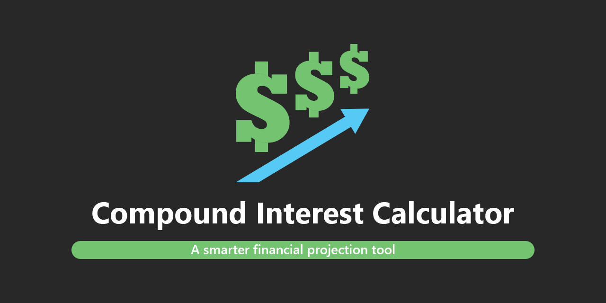
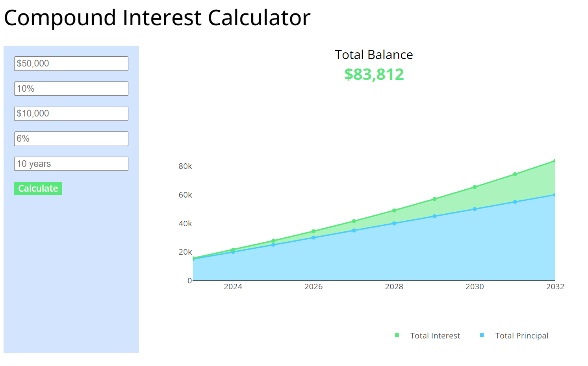

<table align="center">
  <tr>
    <td width="50%">
      <h1>👋 Hi, I'm Blake</h1>
      <h3 style="color: #e0a5e4;">All about me</h3>
      
I'm a Master's of Computer Science candidate at the <a href="https://illinois.edu/">University of Illinois Urbana-Champaign</a>.

      
I've worked on a data science team @ <a href="https://www.caterpillar.com/">Caterpillar Inc.</a> for two years; and in that time I've garnered a good deal of experience both creating models and engineering software into production.

      
My end goal is to combine my skillsets into one medium and become a machine learning engineer.

    </td>
    <td width=10%>
        

    </td>
    <td>
      <!-- Your image -->
      
    </td>
  </tr>
</table>

# 🔨 Tools

<h3 style="color: #e0a5e4"> 
Languages I've learned, packages I prefer, and frameworks I'm fond of
</h3>

<table align="center">
    <tr>
        <td style="text-align: center;" width="40%" valign="top">
            <h3>Data Science & Analysis</h3>
            
            
            
            
            
            
            
            
            
            
            
        </td>
        <td style="text-align: center;" width="40%" valign="top">
            <h3>Development</h3>
            
            
            
            
            
            
            
            
            
            
            
            
            
            
        </td>
    </tr>
</table>

# 📌 Recent projects

<h3 style="color: #e0a5e4"> 
Some cool things I've been working on
</h3>

<a href="https://github.com/eskin22/CompoundInterestCalculator" style="text-decoration: none; color: inherit">

    <h3>Compound Interest Calculator<h3>
    
      
    

</a>

# 📫 Contact

<h3 style="color: #e0a5e4"> 
You can connect with me at these places
</h3>

 

    
    

